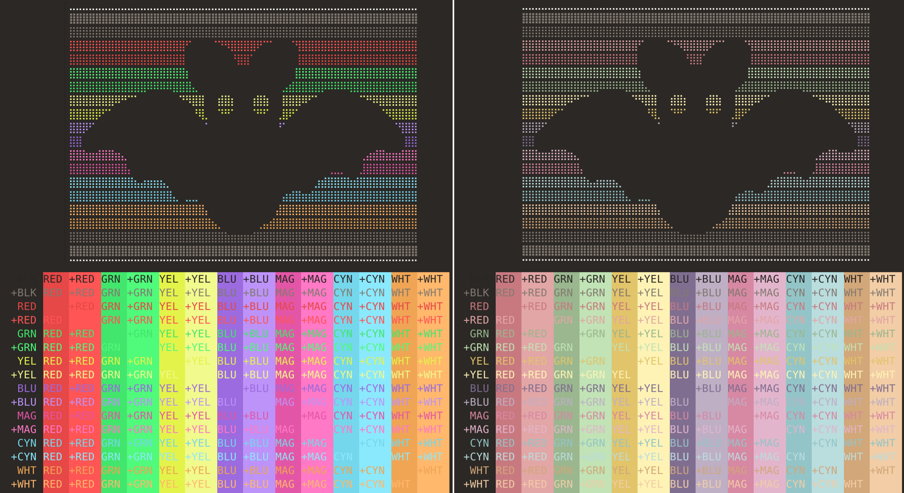

# Chocula Gnome Terminal Themes
Dark brown themes with [Dracula palette](https://github.com/dracula/gnome-terminal) or pastel accent colors for [Gnome Terminal](https://wiki.gnome.org/Apps/Terminal)

## Installation
- Download and extract the [zip file](https://github.com/SueDonham/chocula-gnome-terminal-themes/archive/refs/heads/main.zip) or run `git clone https://github.com/SueDonham/chocula-gnome-terminal-themes.git` in a terminal.
- Open a terminal window in the cloned or extracted directory and run: `./install.sh`
- The interactive installation script creates a profile (or profiles) corresponding to the selected theme(s) and updates the user's configuration file.
- Uninstall via the settings menu (Edit > Preferences > Select profile > Delete).

## License
[MIT](./LICENSE)
